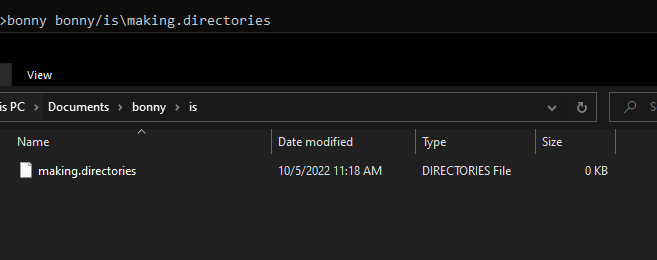

# Bonny
## What is this
A file/folder creation tool for windows.

## Syntax
It has the default / syntax and can work with the \ syntax 
More in usage. If you want to make a file without extension after having made a directory like 
bonny bin/file 
You need to add a dot after file or else it will make it a directory like 
bonny bin/file. 
(The dot doesn't show up)

## How to setup
Add to path
## Usage

Bonny {path + file extension, EG: this/is/my/dir/file.txt} 
Bonny {path, EG: this/is/my/dir}  
Bonny {filename EG: text.txt}  
